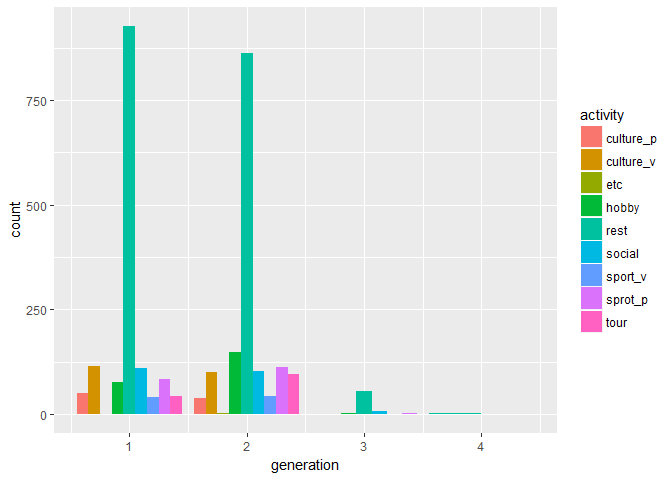
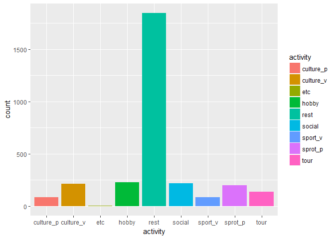
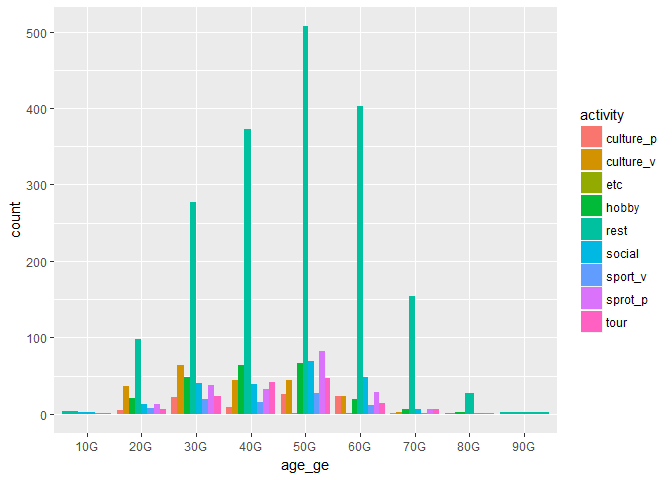

60170420\_report
================

가족유형, 성별, 연령별 여가활동 특성 비교
=========================================

### 요약(초록)

알아보고자 하는 변수는 크게 가족 유형, 성, 연령 3가지 이다. 특히 가족 유형에서는 세대별 분석과 노인 또는 영유아와 함께 사는 가정별 분석도 함께 하고자 한다. 이렇게 유형별로 선호하는 여가활동을 알아보고 그 이유를 유형별 특징에서 찾아 결론을 도출할 것이다. 우선 응답자의 성별만을 나타내는 변수가 없기 때문에 가족 구성원의 성별에 대해 응답한 문항을 이용해 응답자만의 성별 변수를 만들고자 한다. 그렇게 되면 준비된 가족 유형별, 성별, 연령별 데이터를 모두 알아보기 쉬운 변수명으로 수정하고 전처리하여 분석할 준비를 한다. 분석 과정에서는 모든 변수별 선호하는 여가활동을 알아보고 그래프를 도출한다. 결론적으로는 모든 유형별로 선호하는 여가활동의 특성이 있기는 했지만 ‘휴식활동’이 모든 변수에서 압도적인 1위를 차지했다.

### 분석 주제

분석 주제는 ‘가족 유형, 연령, 성별 여가활동의 특성 비교’이다. 이러한 주제를 선정한 이유는 현대인들의 삶의 질이 올라가면서 소득활동에만 집중하는 것이 아닌 자신에게 힐링을 선물하는 여가활동에도 관심을 가지고 있기 때문이다. 그러한 이유로 요즘 사람들은 어떤 여가활동을 즐기고 있는지 다양한 유형별로 알아보고자 한다. 이러한 분석을 통해 타겟을 겨냥한 여가활동 마케팅도 가능해질 것이다.

### 데이터 소개

•서울복지실태조사 \[<http://data.si.re.kr/sisurvey2015er17>\]

### 분석

#### -패키지 로드

``` r
library(dplyr)
```

    ## 
    ## Attaching package: 'dplyr'

    ## The following objects are masked from 'package:stats':
    ## 
    ##     filter, lag

    ## The following objects are masked from 'package:base':
    ## 
    ##     intersect, setdiff, setequal, union

``` r
library(ggplot2)
library(readxl)
```

#### -데이터 불러오기

``` r
raw_welfare <- read_excel("2015_welfare data.xlsx")
```

    ## Warning in read_fun(path = path, sheet = sheet, limits = limits, shim =
    ## shim, : Expecting logical in UM1007 / R1007C559: got '媛쒖씤援먯궗'

    ## Warning in read_fun(path = path, sheet = sheet, limits = limits, shim =
    ## shim, : Expecting logical in AES2190 / R2190C825: got '�쒓낏�꾩썝�앺솢'

    ## Warning in read_fun(path = path, sheet = sheet, limits = limits, shim =
    ## shim, : Expecting logical in PG2194 / R2194C423: got '1�멸�援�'

    ## Warning in read_fun(path = path, sheet = sheet, limits = limits, shim =
    ## shim, : Expecting logical in AES2247 / R2247C825: got '�쒓낏�꾩썝�앺솢'

    ## Warning in read_fun(path = path, sheet = sheet, limits = limits, shim =
    ## shim, : Expecting logical in AES2257 / R2257C825: got '�쒓낏�꾩썝�앺솢'

#### -복사본 생성

``` r
welfare_before <- raw_welfare
```

#### -필요한 변수만 추출

``` r
welfare <- welfare_before %>% 
  select(respondent, A1_3_1, A1_3_2, A1_3_3, A1_3_4, A1_3_5, A1_3_6,
         age_1, age_2, age_3, age_4, age_5, age_6,
         A1_10, fam_t, fam_t_t, fam_m, fam_o, fam_y, fam_h, D12_1, D12_2, D13)
```

#### -데이터 파악

``` r
head(welfare)
```

    ## # A tibble: 6 x 23
    ##   respondent A1_3_1 A1_3_2 A1_3_3 A1_3_4 A1_3_5 A1_3_6 age_1 age_2 age_3
    ##        <dbl>  <dbl>  <dbl>  <dbl>  <dbl>  <dbl>  <dbl> <dbl> <dbl> <dbl>
    ## 1         1.     1.     2.     1.     2.     NA     NA   61.   57.   31.
    ## 2         2.     1.     2.     1.    NA      NA     NA   65.   60.   26.
    ## 3         2.     1.     2.     1.    NA      NA     NA   51.   19.   23.
    ## 4         1.     1.     2.     2.     2.     NA     NA   53.   53.   30.
    ## 5         1.     2.     2.    NA     NA      NA     NA   49.   20.   NA 
    ## 6         2.     1.     2.    NA     NA      NA     NA   77.   71.   NA 
    ## # ... with 13 more variables: age_4 <dbl>, age_5 <dbl>, age_6 <dbl>,
    ## #   A1_10 <dbl>, fam_t <dbl>, fam_t_t <dbl>, fam_m <dbl>, fam_o <dbl>,
    ## #   fam_y <dbl>, fam_h <dbl>, D12_1 <dbl>, D12_2 <dbl>, D13 <dbl>

``` r
tail(welfare)
```

    ## # A tibble: 6 x 23
    ##   respondent A1_3_1 A1_3_2 A1_3_3 A1_3_4 A1_3_5 A1_3_6 age_1 age_2 age_3
    ##        <dbl>  <dbl>  <dbl>  <dbl>  <dbl>  <dbl>  <dbl> <dbl> <dbl> <dbl>
    ## 1         1.     1.    NA     NA     NA      NA     NA   67.   NA    NA 
    ## 2         1.     1.     2.     2.    NA      NA     NA   60.   57.   26.
    ## 3         1.     1.    NA     NA     NA      NA     NA   67.   NA    NA 
    ## 4         2.     1.     2.     1.     2.     NA     NA   50.   47.   25.
    ## 5         1.     2.    NA     NA     NA      NA     NA   34.   NA    NA 
    ## 6         1.     2.    NA     NA     NA      NA     NA   64.   NA    NA 
    ## # ... with 13 more variables: age_4 <dbl>, age_5 <dbl>, age_6 <dbl>,
    ## #   A1_10 <dbl>, fam_t <dbl>, fam_t_t <dbl>, fam_m <dbl>, fam_o <dbl>,
    ## #   fam_y <dbl>, fam_h <dbl>, D12_1 <dbl>, D12_2 <dbl>, D13 <dbl>

``` r
View(welfare)
dim(welfare)
```

    ## [1] 3019   23

``` r
summary(welfare)
```

    ##    respondent        A1_3_1          A1_3_2          A1_3_3    
    ##  Min.   :1.000   Min.   :1.000   Min.   :1.000   Min.   :1.00  
    ##  1st Qu.:1.000   1st Qu.:1.000   1st Qu.:2.000   1st Qu.:1.00  
    ##  Median :1.000   Median :1.000   Median :2.000   Median :1.00  
    ##  Mean   :1.495   Mean   :1.275   Mean   :1.907   Mean   :1.49  
    ##  3rd Qu.:2.000   3rd Qu.:2.000   3rd Qu.:2.000   3rd Qu.:2.00  
    ##  Max.   :6.000   Max.   :2.000   Max.   :2.000   Max.   :2.00  
    ##                                  NA's   :797     NA's   :1641  
    ##      A1_3_4          A1_3_5          A1_3_6          age_1      
    ##  Min.   :1.000   Min.   :1.000   Min.   :1.000   Min.   :18.00  
    ##  1st Qu.:1.000   1st Qu.:1.000   1st Qu.:1.000   1st Qu.:43.00  
    ##  Median :2.000   Median :1.000   Median :1.000   Median :53.00  
    ##  Mean   :1.543   Mean   :1.433   Mean   :1.474   Mean   :51.97  
    ##  3rd Qu.:2.000   3rd Qu.:2.000   3rd Qu.:2.000   3rd Qu.:61.00  
    ##  Max.   :2.000   Max.   :2.000   Max.   :2.000   Max.   :95.00  
    ##  NA's   :2305    NA's   :2929    NA's   :3000                   
    ##      age_2           age_3           age_4           age_5      
    ##  Min.   : 1.00   Min.   : 0.00   Min.   : 0.00   Min.   : 1.00  
    ##  1st Qu.:36.00   1st Qu.:14.00   1st Qu.:12.00   1st Qu.: 8.00  
    ##  Median :48.00   Median :21.00   Median :18.00   Median :15.00  
    ##  Mean   :46.98   Mean   :20.44   Mean   :17.89   Mean   :22.52  
    ##  3rd Qu.:57.00   3rd Qu.:26.00   3rd Qu.:22.00   3rd Qu.:25.75  
    ##  Max.   :92.00   Max.   :93.00   Max.   :86.00   Max.   :81.00  
    ##  NA's   :797     NA's   :1641    NA's   :2305    NA's   :2929   
    ##      age_6           A1_10           fam_t          fam_t_t      
    ##  Min.   : 3.00   Min.   :1.000   Min.   :1.000   Min.   : 1.000  
    ##  1st Qu.: 7.00   1st Qu.:1.000   1st Qu.:1.000   1st Qu.: 1.000  
    ##  Median :19.00   Median :6.000   Median :2.000   Median : 5.000  
    ##  Mean   :24.68   Mean   :4.622   Mean   :1.548   Mean   : 3.664  
    ##  3rd Qu.:30.50   3rd Qu.:6.000   3rd Qu.:2.000   3rd Qu.: 5.000  
    ##  Max.   :77.00   Max.   :6.000   Max.   :4.000   Max.   :35.000  
    ##  NA's   :3000                                                    
    ##      fam_m           fam_o           fam_y          fam_h      
    ##  Min.   :1.000   Min.   :1.000   Min.   :1.00   Min.   :1.000  
    ##  1st Qu.:2.000   1st Qu.:2.000   1st Qu.:2.00   1st Qu.:2.000  
    ##  Median :2.000   Median :2.000   Median :2.00   Median :2.000  
    ##  Mean   :1.998   Mean   :1.805   Mean   :1.93   Mean   :1.972  
    ##  3rd Qu.:2.000   3rd Qu.:2.000   3rd Qu.:2.00   3rd Qu.:2.000  
    ##  Max.   :2.000   Max.   :2.000   Max.   :2.00   Max.   :2.000  
    ##                                                                
    ##      D12_1           D12_2            D13       
    ##  Min.   :1.000   Min.   :1.000   Min.   :1.000  
    ##  1st Qu.:1.000   1st Qu.:2.000   1st Qu.:1.000  
    ##  Median :1.000   Median :5.000   Median :2.000  
    ##  Mean   :2.673   Mean   :4.788   Mean   :2.153  
    ##  3rd Qu.:5.000   3rd Qu.:7.000   3rd Qu.:3.000  
    ##  Max.   :9.000   Max.   :9.000   Max.   :5.000  
    ##                  NA's   :119

#### -성별 변수 생성

``` r
welfare$sex <- ifelse(welfare$respondent == 1, welfare$A1_3_1, 
                      ifelse(welfare$respondent == 2, welfare$A1_3_2,
                             ifelse(welfare$respondent == 3, welfare$A1_3_3,
                                    ifelse(welfare$respondent == 4, welfare$A1_3_4,
                                           ifelse(welfare$respondent == 5, welfare$A1_3_5,
                                                  ifelse(welfare$respondent == 6, welfare$A1_3_6, NA))))))
```

#### -연령대 변수 생성

``` r
welfare$age <- ifelse(welfare$respondent == 1, welfare$age_1, 
                      ifelse(welfare$respondent == 2, welfare$age_2,
                             ifelse(welfare$respondent == 3, welfare$age_3,
                                    ifelse(welfare$respondent == 4, welfare$age_4,
                                           ifelse(welfare$respondent == 5, welfare$age_5,
                                                  ifelse(welfare$respondent == 6, welfare$age_6, NA))))))

welfare$age_ge <- ifelse(welfare$age < 20, "10G",
                         ifelse(welfare$age < 30, "20G",
                                ifelse(welfare$age < 40, "30G",
                                       ifelse(welfare$age < 50, "40G",
                                              ifelse(welfare$age < 60, "50G",
                                                     ifelse(welfare$age < 70, "60G",
                                                            ifelse(welfare$age < 80, "70G",
                                                                   ifelse(welfare$age < 90, "80G",
                                                                          ifelse(welfare$age < 100, "90G", NA)))))))))
```

#### -필요한 변수만 추출

``` r
welfare <- welfare%>% 
  select(fam_t, fam_o, fam_y, D12_1, sex, age_ge)
```

#### -변수 이름 수정

``` r
welfare <- rename(welfare,
                  generation = fam_t,
                  senior = fam_o,
                  baby = fam_y,
                  activity = D12_1)
```

#### -이상치, 결측치 확인(generation)

``` r
table(welfare$generation)
```

    ## 
    ##    1    2    3    4 
    ## 1443 1501   71    4

``` r
table(is.na(welfare$generation))
```

    ## 
    ## FALSE 
    ##  3019

#### -이상치, 결측치 확인(senior)

``` r
table(welfare$senior)
```

    ## 
    ##    1    2 
    ##  588 2431

``` r
table(is.na(welfare$senior))
```

    ## 
    ## FALSE 
    ##  3019

#### -항목 이름 부여(senior)

``` r
welfare$senior <- ifelse(welfare$senior == 1, "T", "F")
```

#### -이상치, 결측치 확인(baby)

``` r
table(welfare$baby)
```

    ## 
    ##    1    2 
    ##  212 2807

``` r
table(is.na(welfare$baby))
```

    ## 
    ## FALSE 
    ##  3019

#### -항목 이름 부여(baby)

``` r
welfare$baby <- ifelse(welfare$baby == 1, "T", "F")
```

#### -이상치, 결측치 확인(activity)

``` r
table(welfare$activity)
```

    ## 
    ##    1    2    3    4    5    6    7    8    9 
    ## 1845  215   87   85  200  139  227  218    3

``` r
table(is.na(welfare$activity))
```

    ## 
    ## FALSE 
    ##  3019

#### -항목 이름 부여(activity)

``` r
welfare$activity <- ifelse(welfare$activity == 1, "rest",
                            ifelse(welfare$activity == 2, "culture_v",
                                   ifelse(welfare$activity == 3, "culture_p",
                                          ifelse(welfare$activity == 4, "sport_v",
                                                 ifelse(welfare$activity == 5, "sprot_p",
                                                        ifelse(welfare$activity == 6, "tour",
                                                               ifelse(welfare$activity == 7, "hobby",
                                                                      ifelse(welfare$activity == 8, "social",
                                                                             ifelse(welfare$activity == 9, "etc", NA)))))))))
```

#### -이상치, 결측치 확인(sex)

``` r
table(welfare$sex)
```

    ## 
    ##    1    2 
    ##  817 2202

``` r
table(is.na(welfare$sex))
```

    ## 
    ## FALSE 
    ##  3019

#### -항목 이름 부여(sex)

``` r
welfare$sex <- ifelse(welfare$sex == 1, "male", "female")
```

#### -이상치, 결측치 확인(age)

``` r
table(welfare$age_ge)
```

    ## 
    ## 10G 20G 30G 40G 50G 60G 70G 80G 90G 
    ##   7 200 532 619 870 573 183  33   2

``` r
table(is.na(welfare$age_ge))
```

    ## 
    ## FALSE 
    ##  3019

#### -가족 유형별(세대) 선호 여가활동

``` r
welfare %>% 
  group_by(generation, activity) %>% 
  summarise(g_count=n())
```

    ## # A tibble: 27 x 3
    ## # Groups:   generation [?]
    ##    generation activity  g_count
    ##         <dbl> <chr>       <int>
    ##  1         1. culture_p      49
    ##  2         1. culture_v     114
    ##  3         1. etc             1
    ##  4         1. hobby          77
    ##  5         1. rest          926
    ##  6         1. social        109
    ##  7         1. sport_v        40
    ##  8         1. sprot_p        84
    ##  9         1. tour           43
    ## 10         2. culture_p      37
    ## # ... with 17 more rows

``` r
ggplot(data = welfare, aes(x = generation, fill = activity))+
  geom_bar(position = "dodge")
```



#### -노인 포함 가구 선호 여가활동

``` r
welfare %>% 
  filter(senior == "T") %>%
  group_by(activity) %>% 
  summarise(s_count=n())%>% 
  arrange(desc(s_count))
```

    ## # A tibble: 9 x 2
    ##   activity  s_count
    ##   <chr>       <int>
    ## 1 rest          439
    ## 2 social         37
    ## 3 sprot_p        25
    ## 4 hobby          23
    ## 5 culture_p      19
    ## 6 tour           18
    ## 7 culture_v      17
    ## 8 sport_v         8
    ## 9 etc             2

``` r
ggplot(data = welfare, aes(x=activity)) + 
  geom_bar(aes(fill = activity))
```


#### -영유아 포함 가구 선호 여가활동

``` r
welfare %>% 
  filter(baby == "T") %>%
  group_by(activity) %>% 
  summarise(b_count=n())%>% 
  arrange(desc(b_count))
```

    ## # A tibble: 8 x 2
    ##   activity  b_count
    ##   <chr>       <int>
    ## 1 rest          149
    ## 2 hobby          17
    ## 3 social         12
    ## 4 culture_v      10
    ## 5 sprot_p        10
    ## 6 tour            9
    ## 7 sport_v         4
    ## 8 culture_p       1

``` r
ggplot(data = welfare, aes(x=activity)) + 
  geom_bar(aes(fill = activity))
```



#### -성별 선호 여가활동

``` r
welfare %>% 
  group_by(sex, activity) %>% 
  summarise(se_count=n())
```

    ## # A tibble: 18 x 3
    ## # Groups:   sex [?]
    ##    sex    activity  se_count
    ##    <chr>  <chr>        <int>
    ##  1 female culture_p       74
    ##  2 female culture_v      160
    ##  3 female etc              1
    ##  4 female hobby          160
    ##  5 female rest          1359
    ##  6 female social         168
    ##  7 female sport_v         45
    ##  8 female sprot_p        135
    ##  9 female tour           100
    ## 10 male   culture_p       13
    ## 11 male   culture_v       55
    ## 12 male   etc              2
    ## 13 male   hobby           67
    ## 14 male   rest           486
    ## 15 male   social          50
    ## 16 male   sport_v         40
    ## 17 male   sprot_p         65
    ## 18 male   tour            39

``` r
ggplot(data = welfare, aes(x = sex, fill = activity))+
  geom_bar(position = "dodge")
```


#### -연령대별 선호 여가활동

``` r
welfare %>% 
  group_by(age_ge, activity) %>% 
  summarise(a_count=n()) 
```

    ## # A tibble: 59 x 3
    ## # Groups:   age_ge [?]
    ##    age_ge activity  a_count
    ##    <chr>  <chr>       <int>
    ##  1 10G    rest            4
    ##  2 10G    social          2
    ##  3 10G    sport_v         1
    ##  4 20G    culture_p       5
    ##  5 20G    culture_v      36
    ##  6 20G    hobby          21
    ##  7 20G    rest           98
    ##  8 20G    social         13
    ##  9 20G    sport_v         8
    ## 10 20G    sprot_p        13
    ## # ... with 49 more rows

``` r
ggplot(data = welfare, aes(x = age_ge, fill = activity))+
  geom_bar(position = "dodge")
```



#### -분석 및 해석

가장 먼저 주목해야 할 점은 모든 조건에서 사람들이 가장 선호했던 여가활동은 ‘휴식’이었다는 점이다. 휴식은 모든 조건에서 압도적인 수치로 1위를 차지하고 있다. 이는 현대인들이 바쁜 일상에 지쳐 체력적인 한계를 느끼고 휴식을 많이 선호하고 있을 것이라는 추측이 가능하다. 또한 물가가 계속해서 오르면서 제대로 된 여가활동을 즐기고자 한다면 그 비용 또한 무시할 수 없어 집에서 휴식을 취하는 여가활동을 즐기는 사람이 많아졌을 것으로 보인다. 집에만 붙어있는 사람을 뜻하는 ‘집돌이’, ‘집순이’라는 용어가 나오는 이유도 사람들이 이렇게 휴식을 굉장히 선호하기 때문이 아닐까 싶다. 그래서 휴식은 모든 조건에서 1위기 때문에 각 조건에서 사람들이 2위로 선호하는 여가활동에 대해서 알아보고자 한다. 그에 앞서 4세대 가족은 응답자가 거의 없어 그 결과에 의미가 없을 것이라고 판단하여 결론 도출에서 제외한다. 일단 가족 유형별 조건에서 1세대 즉, 혼자 살거나 또는 배우자만 함께 사는 사람들은 보통 문화 예술 관람 활동을 비교적 선호 했다. 전시회, 연극, 무용, 공연, 연주회 등 문화 예술 관람 활동에 대표적인 컨텐츠들은 다른 여가활동 보다 비교적 비용이 많이 드는 여가활동이다. 혼자 살거나 배우자만 함께 사는 사람들은 부양해야 할 가족이 없어 여가활동에 더 많은 투자를 하는 양상을 보인다고 볼 수 있다. 이어 2세대, 즉 자녀와 함께 사는 가족은 보통 취미/오락 활동을 선호했다. 자녀를 두고 있는 만큼 체험 위주의 여가활동을 즐기고 있는 것이다. 함께 분석한 영유아를 양육하고 있는 가정에서도 2세대 가족과 마찬가지로 취미/오락 활동을 선호하고 있었다. 앞서 이야기한 2세대 가족과 영유아가 있는 가정이 취미/오락 활동을 선호하는 이유가 같은 맥락이라고 볼 수 있다. 마지막 3세대, 즉 조부모, 부모, 자녀까지 함께 생활하고 있는 가족은 종교활동, 동호회, 동창회, 계모임과 같은 사회활동을 선호한다. 이는 조부모와 부모 같은 중장년층이 선호하는 여가활동이 반영된 결과로 보인다. 또한 함께 분석한 노인을 부양하는 가정에서도 3세대 가족과 마찬가지로 사회활동을 선호했다. 위의 2세대 가족과 영유아 가족과 마찬가지로 3세대 가족과 노인 가족이 선호하는 여가활동이 같다는 것은 같은 맥락에서 이유를 찾을 수 있을 것이다. 추가적으로, 응답자 연령대별 선호하는 여가활동이 가족 유형별 선호하는 여가활동과 거의 일맥상통하는 모습을 볼 수 있다. 20대와 30대가 선호하는 여가활동은 1세대 가족과 마찬가지로 문화예술 관람 활동, 40대가 선호하는 여가활동은 2세대 가족과 마찬가지로 취미활동, 60대가 선호하는 여가활동은 3세대 가족과 마찬가지로 사회활동이었다. 이에 더해 성별 선호하는 여가활동에서 여성은 함께 이야기를 나누는 활동인 사회활동, 남성은 역동적이고 체험적인 성격이 강한 취미/오락 활동을 선호한다. 이 또한 여성과 남성의 특성이 정확히 반영된 여가활동으로 보인다.

### 논의

#### -한계점

첫 번째 한계점으로는 ‘휴식’이라는 여가활동의 선호도가 전체적으로 너무 높아서 그 외의 여가활동의 선호도에 대해 많은 의미를 부여하는 것이 어렵다는 점이다. 비록 결론적으로 각 변수 특성과 비슷한 결과가 도출되긴 하였지만 표본이 더 커지면 결과가 달라질 수도 있을 것이라는 생각이 들었다. 두 번째 한계점으로는 앞서 말한 한계점과 비슷한 맥락으로 표본의 수가 비교적 적었다. 특히 20대, 30대, 40대, 50대의 표본에만 집중되어 그 외의 연령대의 선호도가 분석 가치가 없어져 아쉬웠다.

#### -추후 분석 방향

표본의 수를 더 늘려 1세대 중에서도 독신가구 또는 부부가구, 2세대 중에서도 한부모 가정 또는 부모자녀 가정, 이런 식으로 세대 특징 안의 특징까지 고려해 분석한다면 더욱 정확한 분석이 될 수 있을 것이다.
